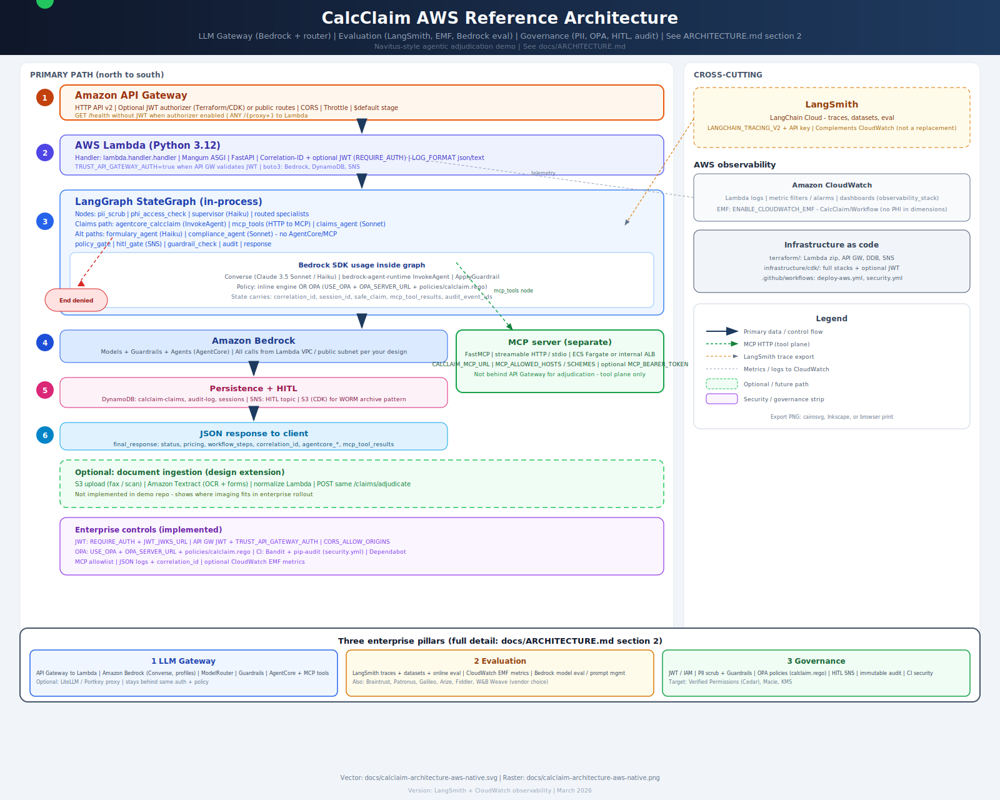

# CalcClaim — Navitus Enterprise Agentic AI Demo (v2)

Pharmacy benefit claim adjudication demo built on the **Navitus Inference Optimizer** architecture.

## Architecture

**Detailed write-up:** [docs/ARCHITECTURE.md](docs/ARCHITECTURE.md) (request path, REST vs MCP, LangGraph order, AWS mapping, observability, optional Textract). **Request-path diagram:** [docs/calclaim-request-flow.drawio](docs/calclaim-request-flow.drawio) (diagrams.net); Mermaid: [docs/calclaim-request-flow.md](docs/calclaim-request-flow.md).




*Text version (same flow as the first diagram):*

```
Request
  │
  ▼
┌──────────────────────────────────────────────────────────────────────┐
│  Governance Pre-flight                                               │
│                                                                      │
│    • PII Scrub (Presidio + regex) → masks PHI before any LLM         │
│    • HIPAA PHI Access Policy → purpose + role check                  │
└──────────────────────────────────────────────────────────────────────┘
  │
  ▼
┌──────────────────────────────────────────────────────────────────────┐
│  LangGraph Multi-Agent Workflow (A2A Protocol)                       │
│                                                                      │
│  Supervisor Agent (Claude Haiku)                                     │
│    • Intent classification + routing                                 │
│    • AgentCore (CalcClaim) → MCP (optional) → Claims Agent (Sonnet)  │
│    • Formulary Agent (Haiku) — tier / PA lookup                      │
│    • Compliance Agent (Sonnet) — HIPAA audit                         │
└──────────────────────────────────────────────────────────────────────┘
  │
  ▼
┌──────────────────────────────────────────────────────────────────────┐
│  Quality & Governance Gate                                           │
│                                                                      │
│    • OPA Policy Engine (T1–T4 tiers, bulk guard, RBAC)               │
│    • HITL Gate (PHI, high-value, tier-5, destructive)                │
│    • Bedrock Guardrails (PII anonymization on LLM output)            │
│    • Immutable Audit (DynamoDB + S3 WORM + CloudWatch)               │
└──────────────────────────────────────────────────────────────────────┘
  │
  ▼
Response + Audit Trail
```

**Two external surfaces (both belong in production):**

1. **API Gateway + Lambda** — HTTP/REST for systems and integrations (`/claims/adjudicate`, `/docs`, …).  
2. **MCP server** (`mcp_servers/`) — Model Context Protocol for AI agents (formulary tools, ID checks, pointer to REST). Deploy as a separate service (ECS/Fargate, EKS, or streamable HTTP behind an internal ALB), not inside the Lambda zip.

### Enterprise features (optional)

JWT at the edge (**Terraform** `enable_jwt_authorizer` / **CDK** `-c jwtIssuer=… -c jwtAudience=…`) or in **FastAPI** (`REQUIRE_AUTH` + `JWT_JWKS_URL`). Structured logs: `LOG_FORMAT=json` and `X-Correlation-ID`. **OPA**: `USE_OPA=true` + `OPA_SERVER_URL` with `policies/calclaim.rego`. **MCP**: `MCP_ALLOWED_HOSTS` / `MCP_ALLOWED_SCHEMES`. CI: `.github/workflows/security.yml` (Bandit + pip-audit), Dependabot. Details: **`docs/ARCHITECTURE.md` §11** (and **§2** for LLM Gateway / Evaluation / Governance pillars).

### AWS Services Used

| Layer | Service |
|---|---|
| LLM inference | Amazon Bedrock (Claude 3.5 Sonnet + Claude 3 Haiku) |
| Agent hosting | Amazon Bedrock AgentCore (in-graph `agentcore_calcclaim` → `invoke_agent`) |
| Agent workflow | LangGraph (compiled StateGraph) |
| Tracing | LangSmith |
| PII detection | Bedrock Guardrails + Presidio |
| Policy engine | Inline OPA-compatible rules (OPA server in production) |
| HITL routing | Amazon SNS + SQS |
| Audit log | DynamoDB + S3 Object Lock (WORM, 7-year HIPAA retention) |
| Auto-rollback | EventBridge + Lambda |
| API | **API Gateway** → Lambda → FastAPI (REST + OpenAPI) |
| Agent tools | **MCP server** (`mcp_servers/`) — formulary/validation tools; full adjudication stays on REST |
| Observability | CloudWatch (dashboards, alarms, metric filters) |
| IaC | AWS CDK (Python) **or** Terraform + GitHub Actions ([policy-agent](https://github.com/elnamir-ahead/policy-agent)-style) |

---

## Project Structure

```
calclaim-demo/
├── policies/
│   └── calclaim.rego                        # OPA policies (USE_OPA + OPA_SERVER_URL)
├── docs/
│   ├── ARCHITECTURE.md                      # Detailed architecture (read this first)
│   ├── calclaim-architecture-flow.png       # LangGraph flow (image)
│   ├── calclaim-architecture-aws-native.png # AWS view (raster; may lag SVG)
│   └── calclaim-architecture-aws-native.svg # AWS + MCP + observability + optional Textract
├── src/
│   ├── data/
│   │   └── fake_data.py          # Fake member/claim/drug/pharmacy data
│   ├── graph/
│   │   ├── state.py              # LangGraph TypedDict state schema
│   │   └── claims_workflow.py    # Full LangGraph graph (nodes + edges)
│   ├── governance/
│   │   ├── pii_scrubber.py       # Presidio + regex PHI scrubber
│   │   ├── audit_logger.py       # Immutable audit (DynamoDB + S3 + CW)
│   │   ├── policy_engine.py      # OPA-style policy rules
│   │   └── hitl_gate.py          # Human-in-the-loop trigger/resolver
│   └── utils/
│       ├── bedrock_client.py     # Bedrock + AgentCore clients, ModelRouter
│       └── langsmith_config.py   # LangSmith tracing + evaluators
├── lambda/
│   └── handler.py                # FastAPI app + Mangum Lambda adapter (API Gateway target)
├── mcp_servers/                  # MCP tool plane for agents (parallel to REST, not a replacement)
│   ├── calclaim_mcp/             # FastMCP server (stdio or streamable HTTP)
│   ├── Dockerfile
│   ├── requirements.txt
│   └── README.md                 # API Gateway vs MCP placement
├── infrastructure/cdk/
│   ├── app.py
│   └── stacks/
│       ├── core_stack.py         # DynamoDB + S3 (WORM)
│       ├── bedrock_stack.py      # Guardrail + AgentCore agent
│       ├── governance_stack.py   # SNS/SQS HITL + auto-rollback Lambda
│       ├── api_stack.py          # Lambda + API Gateway
│       └── observability_stack.py # CloudWatch dashboards + alarms
├── terraform/                    # Terraform IaC (Lambda + API GW + DDB + SNS)
├── scripts/
│   ├── run_demo.py               # Local demo runner (CLI)
│   ├── build_lambda.sh           # Zip Lambda for Terraform / local apply
│   └── deploy_terraform.sh       # build + terraform init/apply
├── .github/
│   ├── workflows/deploy-aws.yml  # CI: build + Terraform apply
│   └── DEPLOY_SETUP.md           # GitHub secrets & IAM notes
├── tests/
│   └── test_calclaim.py          # Unit + integration tests
├── requirements.txt
└── .env.example
```

---

## Quick Start (Local Demo)

### 1. Install dependencies

```bash
cd calclaim-demo
python3 -m venv .venv
source .venv/bin/activate
python3 -m pip install -r requirements.txt
# Optional: NLP-based PII detection (requires Python >=3.10)
# python3 -m pip install -r requirements-optional.txt
```

### 2. Configure environment

```bash
cp .env.example .env
# Edit .env:
#   - Set LANGCHAIN_API_KEY for LangSmith tracing
#   - Set AWS credentials if using real Bedrock
#   - DEMO_MODE=true runs without real AWS (mocked responses)
```

### 3. Run the demo

```bash
# Run 3 demo claims through the full workflow
python3 scripts/run_demo.py

# Run 10 claims
python3 scripts/run_demo.py --n 10

# Test reversal (triggers HITL dual-approval gate)
python3 scripts/run_demo.py --scenario reversal

# Just generate and save fake data
python3 scripts/run_demo.py --generate-data
```

### 4. Run tests

```bash
python3 -m pytest tests/ -v
```

### 5. Start API server locally

```bash
uvicorn lambda.handler:app --reload --port 8000
```

API docs: http://localhost:8000/docs

**Key endpoints:**

| Method | Path | Description |
|---|---|---|
| `POST` | `/claims/adjudicate` | Run full adjudication workflow |
| `POST` | `/claims/reverse` | Initiate claim reversal (HITL) |
| `GET` | `/claims/{id}/audit` | Retrieve immutable audit trail |
| `GET` | `/hitl/pending` | List pending HITL reviews |
| `POST` | `/hitl/resolve` | Reviewer resolves HITL request |
| `POST` | `/demo/batch` | Batch demo run (max 20 claims) |

---

## AWS Deployment

You can deploy with **CDK** (full stacks: S3 WORM, Bedrock agent, observability) or **Terraform** (slimmer path, aligned with [policy-agent](https://github.com/elnamir-ahead/policy-agent): Lambda zip + HTTP API + DynamoDB + SNS + CI).

### Option A — Terraform + GitHub Actions (policy-agent style)

- **Terraform:** `terraform/` — Lambda (`calclaim-api`), API Gateway HTTP API (`ANY /{proxy+}`), DynamoDB (`calclaim-claims`, `calclaim-audit-log`, `calclaim-sessions`), SNS HITL topic, IAM.
- **CI:** `.github/workflows/deploy-aws.yml` — on push to `main`, builds `terraform/build/lambda.zip` and runs `terraform apply`.
- **Secrets:** `AWS_ACCESS_KEY_ID`, `AWS_SECRET_ACCESS_KEY`; optional `LANGCHAIN_API_KEY`.
- **Setup:** see [`.github/DEPLOY_SETUP.md`](.github/DEPLOY_SETUP.md).

Local (same steps as CI):

```bash
chmod +x scripts/build_lambda.sh scripts/deploy_terraform.sh
./scripts/deploy_terraform.sh
```

**Do not** mix CDK and Terraform in the same account/region for the same resource names without importing state — pick one path.

### Option B — AWS CDK (full platform)

#### Prerequisites

```bash
npm install -g aws-cdk
aws configure  # or use AWS SSO
```

#### Deploy all stacks

```bash
cd infrastructure/cdk
pip install -r ../../requirements.txt
cdk bootstrap "aws://ACCOUNT_ID/us-east-1"
cdk deploy --all --context account=ACCOUNT_ID --context region=us-east-1
```

#### Stack deployment order

1. `CalcClaimCore` — DynamoDB + S3 (no dependencies)
2. `CalcClaimBedrock` — Guardrail + AgentCore agent
3. `CalcClaimGovernance` — SNS/SQS HITL + rollback Lambda
4. `CalcClaimAPI` — Lambda + API Gateway
5. `CalcClaimObservability` — CloudWatch dashboards + alarms

#### Post-deployment configuration

After deploying, update `.env` or Lambda env vars with:
- `BEDROCK_GUARDRAIL_ID` from `CalcClaimBedrock` stack output
- `AGENTCORE_AGENT_ID` from `CalcClaimBedrock` stack output
- `HITL_SNS_TOPIC_ARN` from `CalcClaimGovernance` stack output
- `LANGCHAIN_API_KEY` for LangSmith tracing

---

## Governance Features

### PII / PHI Scrubbing
Every claim's raw data is scrubbed by **Presidio** (NLP entity recognition) + regex patterns before being passed to any LLM. The scrubbed safe-copy is what the agents see. Entities detected: SSN, email, phone, DOB, DEA number, NPI, credit cards.

### OPA Policy Engine
Inline policy rules (with OPA HTTP server fallback) enforce:
- **T1–T4 data tier access** per Collibra tags
- **RBAC** — viewer/processor/supervisor roles
- **Bulk guard** — >50 claims/session → HITL
- **Destructive actions** — reversal/override → dual approval
- **Formulary tier restrictions** per plan
- **HIPAA minimum-necessary** purpose check

### HITL Gate
Triggers pause the workflow and route to SNS → reviewer queue for:
- PHI detected in agent output
- Tier-5 specialty drugs (e.g. Keytruda, Ozempic)
- High-value claims (>$1,000 plan liability)
- Reversals / overrides
- In demo mode: auto-resolves with simulated reviewer decision

### Bedrock Guardrails
Applied to all LLM outputs — anonymizes PII entities (SSN, email, name, address, DOB) and blocks harmful content before returning to the caller.

### Immutable Audit Log
Every workflow event is written to:
- **DynamoDB** with `ConditionExpression` preventing overwrites
- **S3 Object Lock WORM** — 7-year HIPAA compliance retention
- **CloudWatch Logs** — real-time SIEM feed
- **SHA-256 integrity hash** per event for tamper detection

### Auto-rollback
EventBridge rule listens for `calclaim.governance/AuditAnomaly` events (e.g. bulk reversal spike, repeated PHI leak flags) and triggers a Lambda rollback function.

---

## LangSmith Tracing

Tracing is **off** until you set a real `LANGCHAIN_API_KEY` (the sample `.env` leaves it empty so you do not get API errors). To enable: set the key, then `LANGCHAIN_TRACING_V2=true`. Every LangGraph run will appear in LangSmith under project `calclaim-demo` with:
- Full node-level traces (pii_scrub → supervisor → claims_agent → policy_gate → ...)
- Metadata tags: `claim_id`, `member_id` (opaque IDs only, no PHI)
- Built-in evaluators: hallucination risk, PII leakage, adjudication accuracy

If you see `403 Forbidden` from `api.smith.langchain.com`, the key is invalid, expired, or lacks ingest permissions — set `LANGCHAIN_TRACING_V2=false` until the key is fixed.

---

## Model Routing

| Task | Model | Reason |
|---|---|---|
| Supervisor routing | Claude 3 Haiku | Fast, low-cost intent classification |
| Formulary lookup | Claude 3 Haiku | Simple structured lookup |
| Adjudication | Claude 3.5 Sonnet | Complex multi-step reasoning |
| Compliance review | Claude 3.5 Sonnet | Nuanced HIPAA analysis |
| Compliance analysis | Claude 3.5 Sonnet | Regulatory depth required |

Cost-vs-latency routing is implemented in `ModelRouter` in `src/utils/bedrock_client.py`.

---

## Fake Data

`src/data/fake_data.py` generates realistic PBM data:
- **Members** — demographics, plan enrollment, eligibility
- **Claims** — NDC, GPI, tier, pricing (ingredient cost, copay, plan pay, AWP)
- **Drugs** — 12 real-world drugs across tiers 1–5 (Lisinopril → Keytruda)
- **Pharmacies** — retail, specialty, mail-order
- **Scenarios** — approved, rejected PA, refill too soon, DUR conflict, reversal
