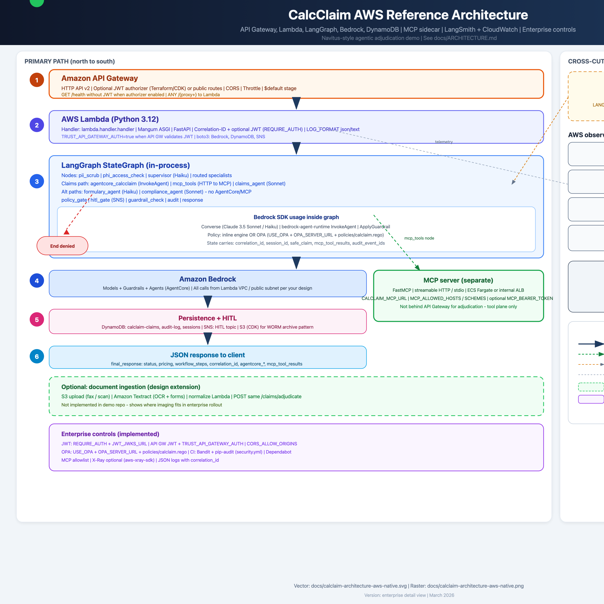

# CalcClaim Enterprise Agentic AI — Technical Report

**Project:** Navitus Inference Optimizer (reference architecture) — CalcClaim demo  
**Version:** 2.0 (demo)  
**Document type:** Implementation summary and operations guide  
**Date:** March 2026  

---

## 1. Executive summary

This deliverable is a **reference implementation** of a pharmacy-benefit **CalcClaim** adjudication flow aligned with the **Navitus Inference Optimizer — Enterprise Agentic AI (v2)** diagram. It uses **synthetic claims data**, **Amazon Bedrock** (Claude Sonnet / Haiku) with a **model router**, **LangGraph** for multi-agent orchestration, **LangSmith**-compatible tracing hooks, **Bedrock Guardrails** and policy-style governance, and **AWS CDK** stacks for optional cloud deployment.

The demo is suitable for **local proof-of-concept** and as a **starting point** for hardening (real OPA, Macie, Collibra tags, production AgentCore wiring, and full data-fabric integration).

**Primary outcomes**

- End-to-end graph: PII handling → supervisor → **AgentCore CalcClaim server** (claims path) → specialist LLMs → policy gate → optional HITL → guardrails → audit → API response.  
- Governance patterns: HIPAA-style purpose checks, RBAC-style rules, tier/high-value/destructive triggers, immutable audit design.  
- Operational clarity: environment bootstrap for LangSmith, Python 3.9–compatible typing, optional Presidio for NLP PII.

### Architecture diagram (image)


*Source file:* `docs/calclaim-architecture-flow.png`

### AWS-native service view (target / mapping diagram)

The following diagram reframes the same logical stages using **AWS service names** and explicitly includes: **Amazon API Gateway** as the north–south entry, an **observability** column (**Amazon CloudWatch** — logs, metric filters, alarms, EMF) and **LangSmith** (LangChain Cloud) for **LLM trace and eval** export alongside Bedrock. (X-Ray, CloudTrail, and EventBridge remain available in AWS and in this repo where wired, but are not shown on the reference diagram.)

The reference code in this repo still uses **LangGraph** locally; this picture is the **cloud-native alignment** story. For a lossless, editable version (e.g. for slides), use the SVG source.



*Raster:* `docs/calclaim-architecture-aws-native.png` · *Vector (full labels):* `docs/calclaim-architecture-aws-native.svg`

**Narrative architecture (detailed, readable first):** see **`docs/ARCHITECTURE.md`** — **§2** defines the three pillars (**LLM Gateway**, **Evaluation**, **Governance**); later sections cover REST path, MCP vs API Gateway, LangGraph order, AWS mapping, observability, enterprise eval tools, optional **S3 + Textract**, and controls.

---

## 2. Scope

### 2.1 In scope

| Area | Description |
|------|-------------|
| Fake data | Members, claims, drugs, pharmacies, plans, reject scenarios (`src/data/fake_data.py`) |
| Orchestration | LangGraph state machine with supervisor + claims / formulary / compliance paths |
| LLM integration | `langchain-aws` ChatBedrock Converse, Sonnet vs Haiku routing (`src/utils/bedrock_client.py`) |
| AgentCore | LangGraph node `agentcore_calcclaim` + `AgentCoreClient` (`invoke_agent`); CDK `CfnAgent`; mock when agent ID unset |
| Governance | PII scrub (regex + optional Presidio), OPA-style policy module, HITL gate (SNS in AWS, auto-resolve in demo), audit logger |
| API | FastAPI + Mangum; Lambda + HTTP API in CDK |
| IaC | CDK stacks: core data, Bedrock guardrail + agent, governance, API, observability |

### 2.2 Out of scope (diagram items not fully implemented)

- Live **Oracle NCRX / ORMB**, **Snowflake**, **Collibra**, **Boomi**, **Qlik** (represented by S3 + fake JSON only).  
- **Amazon Neptune**, **OpenSearch**, **Bedrock KB RAG** (placeholders in architecture; extensible).  
- **CyberArk JIT**, **IAM Identity Center**, **Macie** jobs, **WAF** rules (described in CDK/security narrative; not wired to live org accounts).  
- **Azure DevOps** pipelines (documented as target; no YAML in repo).  
- **LangSmith** cloud project provisioning and org policies (client + env only).

---

## 3. Architecture mapping

The following maps major diagram blocks to repository artifacts.

| Diagram component | Implementation |
|-------------------|----------------|
| Navitus Data Fabric | `fake_data.py` + optional S3 data bucket (`core_stack`) |
| Security & Trust — OPA | `src/governance/policy_engine.py` (inline rules; OPA HTTP optional) |
| Security & Trust — HITL | `src/governance/hitl_gate.py` + SNS/SQS (`governance_stack`) |
| Security & Trust — Guardrails / Macie | Bedrock Guardrail CDK + `BedrockGuardrailChecker`; Macie as design note |
| Data Intelligence — S3 / cache / graph | S3 in CDK; ElastiCache/Neptune/OpenSearch not coded |
| AgentCore + MCP tool servers | In-graph **CalcClaim** step + `AgentCoreClient` + CDK `CfnAgent`; **`mcp_servers/calclaim_mcp`** — FastMCP tools (stdio / streamable HTTP) for agents; **REST adjudication remains on API Gateway → Lambda** |
| Foundation Model Router | `ModelRouter` in `bedrock_client.py` |
| Multi-agent / Supervisor | `supervisor_node` + routed agents in `claims_workflow.py` |
| Quality gate — LLM-as-judge | Evaluator helpers in `langsmith_config.py` (hook for Bedrock eval) |
| Quality gate — PII scrub | `pii_scrubber.py` + guardrail output check |
| Quality gate — Audit | `audit_logger.py` (DynamoDB/S3/CW when `DEMO_MODE=false`) |
| Observability | `observability_stack.py` (CloudWatch dashboards/alarms) |
| Dev / CDK | `infrastructure/cdk/*` |

---

## 4. LangGraph workflow (logical flow)

1. **`pii_scrub`** — Mask member PII; regex scrub on JSON; audit `PII_SCRUB`.  
2. **`phi_access_check`** — Map action → HIPAA purpose (`claim_processing` for `adjudicate`); evaluate allowed purposes; audit `GOVERNANCE_CHECK`.  
3. **`supervisor`** — Haiku classifies intent; routes to claims / formulary / compliance path.  
4. **`agentcore_calcclaim`** (claims path only) — **Bedrock AgentCore** via `bedrock-agent-runtime` `invoke_agent` (`AgentCoreClient`); PHI-safe JSON summary in, server completion out; audit `AGENTCORE_INVOKED`. Mock if `AGENTCORE_AGENT_ID` is empty; skip entirely if `USE_AGENTCORE=false`.  
5. **`mcp_tools`** (claims path only) — Optional **MCP** client: `formulary_tier_lookup` against `CALCLAIM_MCP_URL` (streamable HTTP, e.g. `http://host:8765/mcp`); audit `MCP_TOOLS_INVOKED`. Skipped if URL unset, `USE_MCP_TOOLS=false`, or `mcp` package missing (Python 3.10+ only).  
6. **`claims_agent`** — Sonnet adjudication; **injects AgentCore completion** and **MCP formulary JSON** into the user prompt when present.  
7. **`formulary_agent` / `compliance_agent`** — Haiku / Sonnet; no AgentCore or MCP step (direct from supervisor).  
8. **`policy_gate`** — Claim access + formulary tier rules; may require HITL or deny.  
9. **`hitl_gate`** (conditional) — SNS or demo auto-resolution.  
10. **`guardrail_check`** — Bedrock ApplyGuardrail on agent output when configured.  
11. **`audit`** — Final adjudication audit event.  
12. **`response`** — Assemble `final_response` (includes optional `agentcore_*`, `mcp_tool_results`) for API / CLI.

Conditional edges: PHI deny → `governance_deny`; policy deny → `governance_deny`; HITL → `hitl_gate` then continue or deny.

---

## 5. Governance summary

| Control | Mechanism |
|---------|-----------|
| Minimum necessary | Purpose allow-list + role checks in `policy_engine.py` |
| Tier-5 / high-value | HITL or stricter policy paths |
| Destructive actions | `reverse` / `override` → dual-approval style decision |
| PII in model context | Masked member + scrubbed strings before LLM |
| Output safety | Guardrails + regex-style scrubber on JSON text |
| Audit | Event IDs, integrity hash field, append-only intent in DynamoDB; S3 WORM in CDK |
| Tracing hygiene | `env_bootstrap.py` disables LangSmith when key missing/placeholder |

---

## 6. Environment and execution

### 6.1 Prerequisites

- **Python 3.9+** (3.10+ recommended; 3.9 supported with `Optional[...]` typing and `from __future__ import annotations` where used).  
- **AWS credentials** for Bedrock only if not using mock/fallback behavior (model calls will fail or error without access).  
- **Virtual environment** recommended: `python3 -m venv .venv && source .venv/bin/activate`.

### 6.2 Install

```bash
python3 -m pip install -r requirements.txt
```

Optional NLP PII (Python ≥3.10): `python3 -m pip install -r requirements-optional.txt`

### 6.3 Configuration

Copy `.env.example` → `.env`. Key variables:

- `LANGCHAIN_API_KEY` — leave empty or set a **valid** key; placeholders disable tracing via `env_bootstrap`.  
- `LANGCHAIN_TRACING_V2` — `false` until a real key exists (avoids HTTP 403 noise).  
- `DEMO_MODE` — `true` for in-memory audit; `false` with AWS resources for full persistence.

### 6.4 Run demo

```bash
cd calclaim-demo
export PYTHONPATH=.
python3 scripts/run_demo.py --n 3
```

### 6.5 Tests

```bash
python3 -m pytest tests/ -v
```

### 6.6 Deploy (CDK)

```bash
cd infrastructure/cdk
cdk bootstrap aws://ACCOUNT/REGION
cdk deploy --all --context account=ACCOUNT --context region=REGION
```

Review stack outputs for Guardrail ID, Agent ID, API URL, and SNS topic ARNs.

---

## 7. Issues addressed during hardening

| Issue | Cause | Mitigation |
|-------|--------|------------|
| `spacy` / Presidio install on Python 3.9 | Newer Presidio pulls spaCy requiring Python ≥3.10 for `thinc` | Core `requirements.txt` excludes Presidio; `requirements-optional.txt` for 3.10+ |
| `python` not found on macOS | No `python` shim | README and shebang use `python3` |
| `TypeError: unsupported \| for NoneType` | PEP 604 unions evaluated at runtime under 3.9 (TypedDict / get_type_hints) | `Optional[...]` for unions; `from __future__ import annotations` where appropriate |
| All claims `denied` at PHI gate | `adjudicate` passed as HIPAA `purpose` | Map action → `claim_processing`; expand allow-list in policy engine |
| Empty `plan_id` in policy | Masked member dropped nested `plan` | `mask_member_pii` restores non-PII `plan` object |
| LangSmith HTTP 403 | Tracing on with invalid/placeholder API key | `env_bootstrap.py` + `configure_tracing()`; `.env.example` defaults tracing off |
| `pip` vs `python3` mismatch | Different interpreters | Document `python3 -m pip install` |

---

## 8. Risks and limitations

1. **LLM availability** — Without Bedrock access, supervisor/agents may error or return parse fallbacks; governance paths may still run.  
2. **Demo auto-HITL** — Production must replace auto-approval with real reviewer workflows.  
3. **CDK synthesis** — Stacks reference AWS constructs that must match your account limits and service availability in-region.  
4. **Compliance claims** — This repo is a **technical demo**, not a certified HIPAA or SOC2 control implementation. Legal/compliance review is required before production PHI.

---

## 9. Recommendations

1. **Python 3.11+** in CI and Lambda runtime for simpler typing and Presidio support.  
2. **Wire real OPA** (`OPA_SERVER_URL`) and Collibra tag propagation into policy inputs.  
3. **Add integration tests** with mocked Bedrock responses for deterministic CI.  
4. **Secrets** — Store keys in Secrets Manager / Parameter Store; never commit `.env`.  
5. **Observability** — Export OpenTelemetry to Grafana/Splunk as in the target enterprise diagram.

---

## 10. Artifact index

| Path | Role |
|------|------|
| `src/graph/claims_workflow.py` | LangGraph definition |
| `src/graph/state.py` | `ClaimWorkflowState` TypedDict |
| `src/data/fake_data.py` | Synthetic PBM dataset |
| `src/governance/*.py` | PII, audit, policy, HITL |
| `src/utils/bedrock_client.py` | Bedrock + router + AgentCore + guardrail helper |
| `src/utils/langsmith_config.py` | Tracing configuration and eval hooks |
| `src/utils/env_bootstrap.py` | LangSmith/LangChain env safety (stdlib only) |
| `lambda/handler.py` | HTTP API |
| `scripts/run_demo.py` | CLI demo |
| `infrastructure/cdk/` | AWS infrastructure |
| `tests/test_calclaim.py` | Unit tests |
| `README.md` | Developer quick start |
| `REPORT.md` | This report |
| `docs/calclaim-architecture-flow.png` | LangGraph-oriented flow diagram (image) |
| `docs/calclaim-architecture-aws-native.png` | AWS + API Gateway + observability + LangSmith (raster) |
| `docs/calclaim-architecture-aws-native.svg` | AWS-native diagram (MCP sidecar, optional Textract, legend) |
| `docs/ARCHITECTURE.md` | Canonical detailed architecture narrative |

---

## Document control

| Version | Notes |
|---------|--------|
| 1.0 | Initial REPORT.md aligned with demo v2 and post-hardening fixes |

*End of report.*
