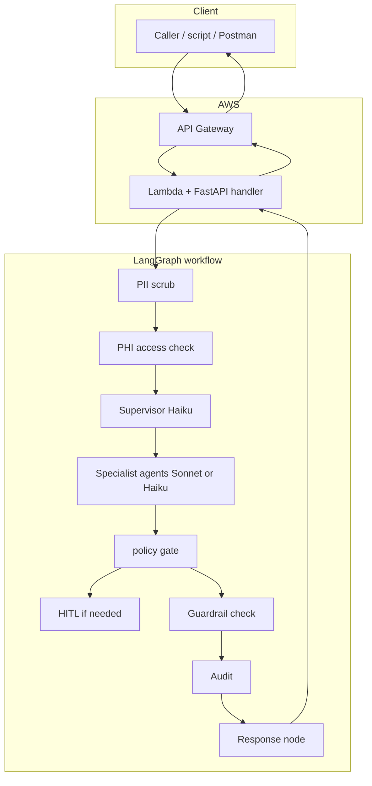

# CalcClaim — request path (Mermaid)

**Editable diagrams.net source (recommended for slides / edits):** [`calclaim-request-flow.drawio`](calclaim-request-flow.drawio) — open in [diagrams.net](https://app.diagrams.net/) or the Draw.io integration in VS Code / Cursor.

High-level flow: **client → API Gateway → Lambda (FastAPI) → LangGraph → response**. The Mermaid below renders on GitHub; use a Mermaid preview extension locally if you prefer this view.

See also: [ARCHITECTURE.md §3–5](ARCHITECTURE.md) and the PNG/SVG diagrams in this folder.

**Note:** The return path (`RES → L → AG → C`) is logical: the HTTP response is produced by FastAPI in Lambda and returns through API Gateway to the caller.
